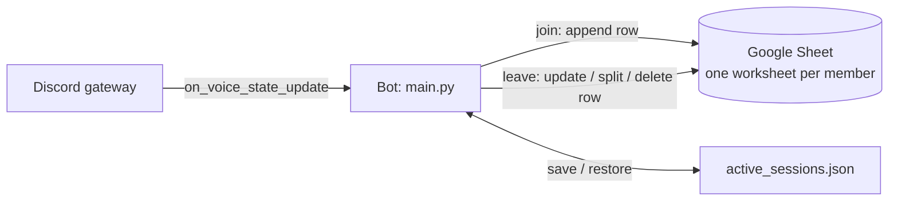

# Voice Logger

> A Discord bot that turns time spent in voice channels into a per-person work log in Google Sheets.

Built for a small study/work group that uses Discord voice channels as a shared "work room". Instead of logging hours by hand, each member's sessions are recorded automatically the moment they join and leave a channel.

## Features

- **Automatic session tracking** - joining a voice channel starts a session, leaving ends it, and moving between channels is treated as leave + join.
- **One worksheet per member** - each tracked member gets their own sheet, created on first use with a header row and a merged summary row.
- **Live status in the sheet** - a row is written on join, and its duration cell shows `작업 중···` ("working") until the member leaves.
- **Sessions across midnight** - a session spanning several days is split into one row per calendar day.
- **Short-session filtering** - sessions shorter than `MIN_SESSION_MINUTES` are deleted from the sheet.
- **Restart safety** - active sessions are saved to `active_sessions.json` and restored when the bot restarts.
- **Per-member time zones and an ignored channel** - each member is logged in their own time zone, and a "break room" channel is not tracked.

## Tech Stack

| Area | Technology |
|---|---|
| Language | Python 3 (asyncio) |
| Discord | [discord.py](https://discordpy.readthedocs.io/) 2.x (voice state and member intents) |
| Storage | Google Sheets via [gspread](https://docs.gspread.org/) + service account (`oauth2client`) |
| Config | `python-dotenv`, `pytz` |

## Architecture



- All gspread calls are blocking, so they run in `asyncio.to_thread` to keep the Discord event loop responsive.
- Row appends are retried up to 3 times with a delay to ride out Google Sheets API errors.
- Durations and the running total are written as Sheets formulas (`LET`, `FILTER`, `REGEXEXTRACT`), so the sheet stays correct if someone edits a start or end time by hand.

### Sheet layout

| Row | A | B | C | D |
|---|---|---|---|---|
| 1 | 날짜 (date) | 시작 시각 (start) | 종료 시각 (end) | 총 작업 시간 (duration) |
| 2 | Total work time (merged A2:D2, formula) | | | |
| 3+ | `MM/DD` | `HH:MM` | `HH:MM` | `XH YYM` |

## Getting Started

### Prerequisites

- Python 3.9+
- A Discord bot application with the **Server Members Intent** enabled (Developer Portal -> Bot -> Privileged Gateway Intents), invited to your server
- A Google Cloud service account with the Google Sheets and Google Drive APIs enabled, and its JSON key file
- A Google Sheet shared with the service account's email (Editor access)

### Installation

```bash
git clone https://github.com/eden-chang/voice_logger.git
cd voice_logger
python -m venv .venv
source .venv/bin/activate        # Windows: .venv\Scripts\activate
pip install -r requirements.txt
cp .env.example .env             # then fill in the values
```

Save the service account key as `credentials.json` in the project root. Both `.env` and `credentials.json` are git-ignored.

### Configure members

Tracked members and the ignored channel are set in `main.py`:

```python
TRACKED_USERS = {
    "<display name>": pytz.timezone("America/Toronto"),
    ...
}
IGNORED_CHANNEL = "휴게실"
```

Keys must match each member's Discord **display name**, which is also used as the worksheet title.

## Environment Variables

| Variable | Description | Example |
|---|---|---|
| `DISCORD_TOKEN` | Discord bot token | `your_discord_token` |
| `SPREADSHEET_ID` | ID of the target Google Sheet (from its URL) | `your_spreadsheet_id` |
| `MIN_SESSION_MINUTES` | Sessions shorter than this are discarded (default `5`) | `5` |

## Usage

```bash
python main.py
```

On startup the bot connects to Google Sheets, restores any saved sessions, adds the summary formula to existing member worksheets if it is missing, and prints its configuration. After that it logs sessions automatically. There are no chat commands.

## Project Structure

```
voice_logger/
├── main.py            # Bot: config, Sheets helpers, session persistence, Discord event handlers
├── requirements.txt
├── .env.example       # Environment variable template
└── .gitignore
```
